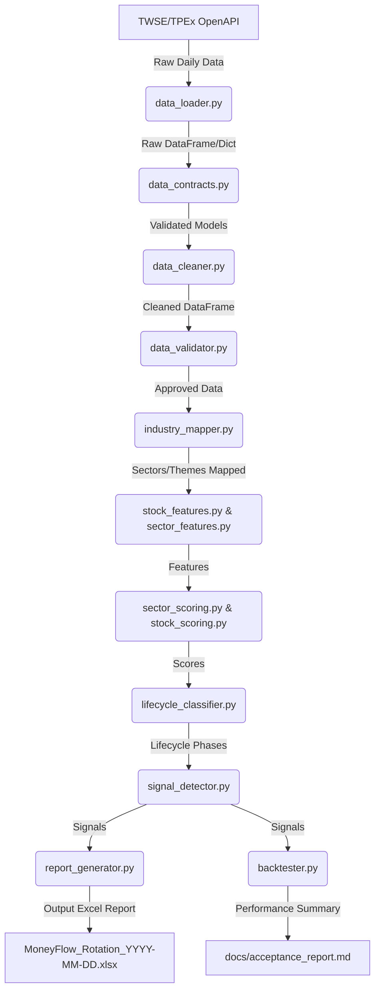

# Taiwan Moneyflow Rotation System - Architecture Specification

This document details the software architecture, modular layout, and execution pipelines of the Taiwan Moneyflow Rotation System.

## 1. System Design Overview

The system is built as a deterministic, modular pipeline. It processes full-market daily raw data (prices, institutions, margins, mapping reference tables), extracts features, scores sectors and stocks, detects rotation signals, and generates daily Excel reports.

---

## 2. Component Design & Responsibilities

### 2.1 Core Config Module (`src/config_manager.py`)
- **Duty**: Loads YAML configuration files.
- **Rules**: Identifies any absolute prior weights or parameters and emits a warning log: *"Warning: Param <name> is marked as PLACEHOLDER - UNCALIBRATED"* if M5回測 calibration is incomplete.

### 2.2 Data Validation & Contracts (`src/data_contracts.py`, `src/data_validator.py`)
- **contracts.py**: Holds Pydantic models for raw rows to guarantee datatype integrity (e.g. stock ID remains string).
- **validator.py**: Evaluates completeness and accuracy, yielding a daily **Data Quality Score (0-100)**.
- **Fail-Closed Guard**: Breaks execution if score < 70, or if core inputs (date mismatch, massive data drops) fail critical constraints.

### 2.3 Cleaner & Mapper (`src/data_cleaner.py`, `src/industry_mapper.py`)
- **cleaner.py**: Standardizes ticker codes, strips spaces, and filters out non-equity targets (e.g., warrants, funds, ETFs).
- **mapper.py**: Merges stock data against `stock_industry_mapping.xlsx`. Ensures that sector transaction volumes are aggregated without double counting across overlapping themes.

### 2.4 Feature Engineering & Scoring (`src/stock_features.py`, `src/sector_features.py`, `src/sector_scoring.py`, `src/stock_scoring.py`)
- **stock_features.py**: Extracts rolling ranking improvements, MA crossovers, and breakout gaps.
- **sector_features.py**: Computes sector breadth (上漲家數 / 總有效家數), total volume share, relative strength, and HHI (Herfindahl-Hirschman Index) to quantify volume concentration.
- **sector_scoring.py**: Scores sectors.
  `Score = 25% Breadth + 25% Volume + 20% Strength + 15% Momentum + 10% Institution + 5% Health`.
  If institutional or margin data is missing, it dynamically re-weights the available factors:
  \[
  W_{new, i} = \frac{W_{old, i}}{\sum W_{available}}
  \]
  and marks the confidence score as `DEGRADED`.

### 2.5 Signal & Backtest Engine (`src/signal_detector.py`, `src/backtester.py`)
- **signal_detector.py**: Triggers A/B/C tier New Gainer and Continued Momentum signals.
- **backtester.py**: Simulates trades. Correctly handles limit-up lockout, warning/disposition stock penalties, and ex-dividend price gaps. Compare signal efficacy against the **Momentum Extension Baseline** and **Random Bootstrap Baseline**.

### 2.6 Report Writer (`src/report_generator.py`)
- **Duty**: Emits a clean Excel workbook containing 4 core sheets:
  1.  `Dashboard`: General indices and data quality score.
  2.  `New Gainer Sectors`: List of newly triggered sectors.
  3.  `Continued Momentum`: Strong sectors currently in acceleration / diffusion phase.
  4.  `Stock Priority List`: Priority ranking of components inside active sectors.
- **Rule**: Excel generation must dynamically resolve font warnings by testing Windows default font fallbacks (`Microsoft JhengHei` -> `Microsoft YaHei` -> `Arial Unicode MS`).
